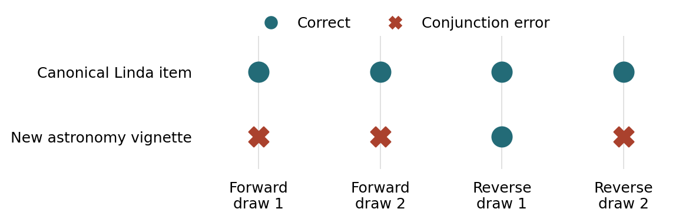

# Bonsai behavioral tests with EDSL

Run PrismML's **Ternary Bonsai 2 27B** locally through [EDSL](https://github.com/expectedparrot/edsl), ask a question, and reproduce an exploratory behavioral battery.

The original run used an **Apple M4 Max MacBook Pro with 48 GB unified memory**, PQ2_0 weights, and PrismML's Metal-enabled llama.cpp fork. The model weights occupy **7.21 GB**; this is not a measurement of total runtime memory. Other Macs have not been tested here. The included launcher targets Apple Silicon macOS; Linux/CUDA requires a different runtime.

## Read the paper

**[Read the 16-page academic report (PDF)](paper/bonsai_edsl_report.pdf)** · **[Open/download the PDF directly](https://raw.githubusercontent.com/expectedparrot/edsl-bonsai-behavioral-tests/main/paper/bonsai_edsl_report.pdf)**

*Local Language-Model Inference with EDSL: An Exploratory Behavioral Evaluation of Bonsai 2 27B* explains the local setup, EDSL code, experimental design, observed answers, limitations, and possible Modal deployment. Its appendix includes every question and the observed answer distributions. The [LaTeX source](paper/bonsai_edsl_report.tex) and [build instructions](paper/README.md) are included.

You can read the paper and inspect all results without installing Python or downloading the model. For a shorter account, start with [the findings below](#what-happened-in-the-original-run), the [full results table](behavioral_bias_run/report.md), or [every prompt and answer](behavioral_bias_run/all_responses.md).

## What we did

We asked two questions: **Can EDSL run this model locally on a MacBook Pro?** And **how does it answer a small set of questions designed to probe behavioral biases?** The local workflow worked. The answers were often correct on explicit numerical and logical tasks, but the model's success on the familiar Linda question did not carry over consistently to a newly written conjunction question.

1. **Connected a local model to EDSL.** We downloaded PrismML's PQ2_0 weights and its Metal-enabled `llama-server`, then exposed the model at `http://127.0.0.1:8087/v1`. EDSL used its existing `openai_compatible` provider to send prompts and collect structured results. Model inference took place on the Mac.
2. **Started with a simple question.** The initial free-text example asked “What is the capital of France?” and returned Paris. We then changed the example to Linda's occupation: is she more likely to be a bank teller, or a bank teller who is also active in the feminist movement? The current [`ask_linda.py`](ask_linda.py) demonstrates that multiple-choice workflow.
3. **Made startup automatic.** A missing or unready server had produced a missing answer in the initial setup. The [`bonsai_server.py`](bonsai_server.py) helper starts the executable as a subprocess, waits for readiness, and cleans up afterward. The example raises on inference failure and checks that an answer was returned.
4. **Expanded to a behavioral battery.** We constructed 21 conditions across 11 task families, with four responses per condition: **84 independent, one-question interviews**. These covered conjunction, base rates, coin-flip independence, framing, anchoring, sunk costs, logical falsification, defaults, payment timing, decoys, and arithmetic. The original run took place September 17, 2026, in the America/New_York time zone.
5. **Saved and audited the evidence.** EDSL saved the Jobs specifications and Results packages. We exported answers, counted matches to explicit answer keys, compared matched preference conditions, and inspected completion IDs, validation, and formatting anomalies. The PDF was written from these saved artifacts; generating the report required no new inference.

### How the experiment was constructed

[`behavioral_biases.py`](behavioral_biases.py) defines each condition's prompt, alternatives where applicable, and scoring key. EDSL turns those definitions into executable interviews:

| EDSL object | Role in this example |
| --- | --- |
| `QuestionMultipleChoice` / `QuestionNumerical` | Defines the answer format and requests a brief explanation. |
| `ScenarioList` | Supplies each prompt and its option order to the question template. |
| `Model` | Selects the local Bonsai alias and generation parameters. |
| `Jobs` | Combines the question, scenarios, and model into a saved execution specification. |
| `Results` | Preserves answers, rendered prompts, raw server responses, and validation data. |

Multiple-choice conditions used the original and reversed option orders, with two draws for each order. Numerical conditions used four iterations. Each interview began independently, with no previous answers, no persona traits, and no bias labels or scoring keys in the rendered question. We requested explanations of at most two sentences.

Generation used temperature 1.0, top-p 0.95, an 8192-token context, a 2048-token output limit, and a 512-token server-side reasoning budget. An empty EDSL cache for each family and distinct iteration keys supported fresh draws; we then checked that all 84 saved completion IDs were distinct. EDSL answer validation checks the response contract—it does **not** establish that the answer or explanation is correct.

See [the methodology](BEHAVIORAL_TESTS.md), [exact conditions and answer keys](behavioral_bias_run/conditions.json), and [recorded protocol](behavioral_bias_run/protocol.json) for details.

### Choose what you want to do

| Goal | Start here |
| --- | --- |
| Read the experiment and its limitations | [PDF report](paper/bonsai_edsl_report.pdf) or [findings](#what-happened-in-the-original-run) |
| Ask one question on your Mac | [Quick start](#quick-start) |
| Understand the dependency and runtime setup | [EDSL installation](#install-edsl-at-the-tested-commit) and [Bonsai installation](#install-the-bonsai-server-and-model) |
| Inspect saved results or run the full battery | [Battery instructions](#run-the-behavioral-battery) |
| Adapt the EDSL code to a new question | [The EDSL connection](#the-edsl-connection) |

## Quick start

On an Apple Silicon Mac, install [uv](https://docs.astral.sh/uv/getting-started/installation/):

```sh
curl -LsSf https://astral.sh/uv/install.sh | sh
```

Open a new terminal after installation so `uv` is on your PATH. If you already use Homebrew, `brew install uv` is an alternative. Then:

```sh
git clone https://github.com/expectedparrot/edsl-bonsai-behavioral-tests.git
cd edsl-bonsai-behavioral-tests
uv python install 3.12
uv sync --locked
uv run python download_model.py
uv run python ask_linda.py
```

The downloader fetches the pinned runtime and approximately 7.21 GB of weights, verifies SHA-256 checksums, and extracts the runtime. Allow disk space for both the weights and Python dependencies. Downloads require internet access; inference runs locally and needs no API key.

`ask_linda.py` starts the server as a subprocess, waits for model readiness, asks the question, saves `runs/linda.results.ep`, and shuts down its server even if inference fails. If a healthy server already runs on port 8087, the script reuses it and leaves it running. A reused server must use the same model alias and intended settings. Startup messages are in `managed-server.log`.

The correct Linda answer is “Linda is a bank teller.” Generated answers can vary.

## Install EDSL at the tested commit

The standalone example was tested with EDSL commit
[`852a050d0b4e84facdaea0628e7c1e062daa4a46`](https://github.com/expectedparrot/edsl/commit/852a050d0b4e84facdaea0628e7c1e062daa4a46),
which reports version `1.0.8.dev1`. This is the revision verified during packaging and the subsequent live Linda smoke test. The original 84-response run recorded the version but not its Git revision, so we cannot establish that its checkout was this exact commit.

**For this repository**, `uv sync --locked` creates `.venv/` and installs that Git revision plus the dependencies pinned in [`uv.lock`](uv.lock). You do not need to install EDSL separately. Python 3.12 and uv 0.11.13 were used for the packaging checks; GitHub's offline checks also use uv 0.11.13.

**To install the same EDSL revision directly in your own environment**, use uv's [package installation interface](https://docs.astral.sh/uv/pip/packages/):

```sh
uv venv --python 3.12
source .venv/bin/activate
uv pip install \
  'edsl @ git+https://github.com/expectedparrot/edsl.git@852a050d0b4e84facdaea0628e7c1e062daa4a46' \
  'openai[aiohttp]==2.54.0'
ep info
```

Run this alternative in the directory where you want your environment. It pins EDSL and the OpenAI SDK; use the repository's lockfile for the full tested dependency set. Installing from Git requires `git` on your PATH. On macOS, `xcode-select --install` installs Apple's command-line developer tools if Git is missing.

The `aiohttp` extra is required by EDSL's asynchronous OpenAI-compatible transport. Our clean-install smoke test failed without it. EDSL uses the SDK to call the local Bonsai endpoint; it does not require an OpenAI account or API key for this example.

To verify the EDSL source revision installed by the quick start:

```sh
uv run python - <<'PY'
import json
from importlib.metadata import distribution

package = distribution("edsl")
source = json.loads(package.read_text("direct_url.json"))
print("EDSL version:", package.version)
print("Git commit:", source["vcs_info"]["commit_id"])
PY
```

The commit printed should be `852a050d0b4e84facdaea0628e7c1e062daa4a46`.

## Install the Bonsai server and model

There are three pieces:

| Piece | Where it comes from | What it does |
| --- | --- | --- |
| [`bonsai_server.py`](bonsai_server.py) | Included when you clone this repository | Python context manager that starts, checks, and stops the server subprocess |
| `llama-server` | PrismML's prebuilt macOS arm64 runtime archive | Loads Bonsai and serves an OpenAI-compatible HTTP API using Metal |
| `Ternary-Bonsai-2-27B-PQ2_0.gguf` | Pinned PrismML model repository on Hugging Face | The model weights loaded by the server |

**`bonsai_server` is a local Python module, not a separate package to install with pip.** Run the examples from this cloned repository so `from bonsai_server import bonsai_server` finds the included file. Installing EDSL alone does not install the Bonsai runtime or model. PrismML's fork is required for the tested weight format; the setup uses its prebuilt executable rather than compiling it.

### Automatic download and installation

From the repository root:

```sh
uv run python download_model.py
uv run python download_model.py --check-only
```

The first command downloads the archive and weights, verifies both against [`downloads.json`](downloads.json), and extracts the runtime into `runtime/`. It reuses already downloaded files when their checksums match. If a transfer is interrupted, run it again; incomplete `.part` files are downloaded afresh rather than resumed. The second command checks the downloaded archive and weights without network access; it does not validate the extracted runtime files individually.

The model file is **7,206,168,928 bytes** (7.21 GB decimal); the runtime archive is approximately 11 MB. Total memory use also includes the model's runtime buffers and context cache. We tested on 48 GB unified memory and did not establish a minimum RAM requirement.

After installation, these paths should exist:

```text
edsl-bonsai-behavioral-tests/
├── bonsai_server.py
├── start-server.sh
├── runtime/
│   ├── llama-macos-arm64.tar.gz
│   └── llama-prism-b10683-d8f26ee/
│       ├── llama-server
│       └── ... runtime libraries and other executables
└── models/
    └── Ternary-Bonsai-2-27B-PQ2_0.gguf
```

The runtime and weights are ignored by Git. The downloader's `--asset-dir PATH` option can verify or download to another location, but `start-server.sh` expects the paths above; changing the download destination alone does not reconfigure the launcher.

### Exact versions and download links

| Asset | Pin |
| --- | --- |
| EDSL | `852a050d0b4e84facdaea0628e7c1e062daa4a46` |
| PrismML runtime release | [`prism-b10683-d8f26ee`](https://github.com/PrismML-Eng/llama.cpp/releases/tag/prism-b10683-d8f26ee) |
| Runtime archive | [llama-prism-b10683-d8f26ee-bin-macos-arm64.tar.gz](https://github.com/PrismML-Eng/llama.cpp/releases/download/prism-b10683-d8f26ee/llama-prism-b10683-d8f26ee-bin-macos-arm64.tar.gz) |
| Hugging Face model repository | [`prism-ml/Ternary-Bonsai-2-27B-gguf`](https://huggingface.co/prism-ml/Ternary-Bonsai-2-27B-gguf) |
| Model revision | `6ed5e12bf84b7a63069882c91dd9e9218647d17b` |
| Weight file | [Ternary-Bonsai-2-27B-PQ2_0.gguf](https://huggingface.co/prism-ml/Ternary-Bonsai-2-27B-gguf/resolve/6ed5e12bf84b7a63069882c91dd9e9218647d17b/Ternary-Bonsai-2-27B-PQ2_0.gguf) |

Expected SHA-256 digests:

```text
Runtime archive:
0ae163ca2c9cce92470316ed743f76985beea4d5cf31b8dc546711cf6fc8dd35

Model weights:
3907dc1658db1f78a9826bf8d5bcb8dc65db0d466388937af57f2294fae62ec1
```

### Manual download alternative

The automatic downloader handles this for you. If you prefer to download explicitly, run the following from the repository root. The checksum must pass before extracting the runtime:

```sh
mkdir -p runtime models

curl -fL --retry 3 \
  https://github.com/PrismML-Eng/llama.cpp/releases/download/prism-b10683-d8f26ee/llama-prism-b10683-d8f26ee-bin-macos-arm64.tar.gz \
  -o runtime/llama-macos-arm64.tar.gz

printf '%s  %s\n' \
  0ae163ca2c9cce92470316ed743f76985beea4d5cf31b8dc546711cf6fc8dd35 \
  runtime/llama-macos-arm64.tar.gz | shasum -a 256 -c - && \
  tar -xzf runtime/llama-macos-arm64.tar.gz -C runtime

curl -fL --retry 3 \
  https://huggingface.co/prism-ml/Ternary-Bonsai-2-27B-gguf/resolve/6ed5e12bf84b7a63069882c91dd9e9218647d17b/Ternary-Bonsai-2-27B-PQ2_0.gguf \
  -o models/Ternary-Bonsai-2-27B-PQ2_0.gguf

uv run python download_model.py --check-only
```

Wait for both assets to verify before running a question. This text-only example does not download a vision projector.

## Start and check the server

For the normal workflow, run `uv run python ask_linda.py`: the Python helper handles startup, readiness, and cleanup automatically. It waits up to 180 seconds for startup; the Linda script allows up to 300 seconds for an inference request.

To keep the server running across multiple scripts, use a separate terminal:

```sh
bash start-server.sh
```

Leave that terminal running. Once the model has loaded, check these endpoints from another terminal:

```sh
curl --fail --silent --show-error http://127.0.0.1:8087/health
curl --fail --silent --show-error http://127.0.0.1:8087/v1/models
```

The health response should contain `"status":"ok"`; the model list should include `bonsai-2-27b`. Then run `uv run python ask_linda.py` from the repository root. It will reuse this server. Press Ctrl-C in the server terminal when finished to release the model's memory.

The server binds to loopback (`127.0.0.1`) and uses port `8087`. EDSL's base URL includes `/v1`: `http://127.0.0.1:8087/v1`. The model name `bonsai-2-27b` is the alias set by the launcher, not the Hugging Face repository name.

### Troubleshooting setup

| Symptom | Check or fix |
| --- | --- |
| `uv: command not found` | Open a new terminal after installing uv and check `uv --version`. |
| `No module named bonsai_server` | Run the script from this repository, alongside `bonsai_server.py`; it is not an EDSL dependency. |
| Missing `llama-server` or GGUF file | Run `uv run python download_model.py` and check the directory layout above. |
| Error requiring the OpenAI SDK's `aiohttp` extra | Run `uv sync --locked`; a manual environment needs `openai[aiohttp]`. |
| Connection refused or model startup timeout | Inspect `managed-server.log`, or run `bash start-server.sh` to see startup diagnostics directly. |
| Port 8087 already in use, or unexpected model replies | Check `/v1/models` and the process serving that port. The helper reuses a healthy server, so confirm its model and settings. |
| Answer is `None` or inference raises an exception | Inspect the server log and saved errors. The example raises on inference failure and checks for a missing answer. |
| Checksum mismatch or interrupted download | Rerun the downloader; it verifies existing files and replaces them only after a successful download and checksum. |

## The EDSL connection

EDSL's existing OpenAI-compatible provider talks to the local server:

```python
from edsl import Cache, Model, QuestionFreeText
from bonsai_server import bonsai_server

model = Model(
    "bonsai-2-27b",
    service_name="openai_compatible",
    base_url="http://127.0.0.1:8087/v1",
    temperature=1.0,
    max_tokens=2048,
)
question = QuestionFreeText(
    question_name="capital",
    question_text="What is the capital of France?",
)
with bonsai_server():
    results = question.by(model).run(
        disable_remote_inference=True,
        disable_remote_cache=True,
        cache=Cache(),
        stop_on_exception=True,
    )
print(results.select("answer.capital").first())
```

The full Linda example adds a longer request timeout and saves the result. `start-server.sh` uses one inference slot, an 8192-token context, Metal GPU offloading, and a 512-token reasoning budget. The Python examples allow 2048 output tokens. These are bounded test settings.

## Run the behavioral battery

Build and validate inputs without loading the model:

```sh
uv run python behavioral_biases.py --build-only
```

Run 84 interviews across 21 conditions and 11 families:

```sh
uv run python behavioral_biases.py
uv run python summarize_biases.py
```

New results go in **`runs/local/`**, separate from the published observations in **`behavioral_bias_run/`**. Complete family results are reused on restart. For an independent rerun:

```sh
uv run python behavioral_biases.py --output runs/replication-01
uv run python summarize_biases.py --output runs/replication-01
```

Model sampling is stochastic and not seeded. The fixed shuffle seed controls scenario order only. The original completion timestamps spanned about 26 minutes, including a checkpoint/resume interval; that is not a controlled throughput benchmark.

To inspect the published results without model weights or inference:

```sh
uv run ep results select \
  --file behavioral_bias_run/conjunction.results.ep \
  --column scenario.condition --column answer.response
```

To regenerate exported tables from the original Results packages:

```sh
uv run python summarize_biases.py --output behavioral_bias_run
```

## What happened in the original run?

The clearest contrast was between two conjunction questions. Bonsai chose **“Linda is a bank teller” in all four draws**, correctly avoiding the more restrictive conjunction. In the new astronomy vignette, however, it chose **“Morgan works as an accountant and belongs to an astronomy club” in three of four draws**, rather than accountant alone.



Each symbol is one response, grouped by option order and draw. A conjunction cannot be more probable than either of its component events: everyone who is both an accountant and an astronomy-club member is an accountant. The model's astronomy-based explanation did not resolve that logical constraint. The errors occurred in both option orders.

Here is what the rest of the battery returned:

| Task or comparison | Observed responses |
| --- | --- |
| Base rates | Correct posterior probabilities: 7.48% with 1% prevalence and 84.21% with 40% prevalence; 4/4 each. |
| Independent coin flips | Heads and tails equally likely after both a streak and a mixed sequence; 4/4 each. |
| Framing | Guaranteed recovery of 300 files in both the saved and lost frames; 4/4 each. |
| Anchoring | Mean estimates of 42.92 hours after anchor 10 and 42.77 after anchor 100; no shift toward the higher anchor. |
| Sunk costs | Stop the unprofitable project after either $0 or $8,000 already spent; 4/4 each. |
| Logical falsification | Turn over E and 7 in the card task; 4/4. |
| Defaults | Chose Plan B in 2/4 draws when A was preselected, versus 1/4 when B was preselected. |
| Payment timing | Later $60 over earlier $50 for both immediate and year-delayed choices; 4/4 each. |
| Decoy | Digital-and-print bundle with or without the print-only decoy; 4/4 each. |
| Arithmetic | Pen costs $0.40 and cake weighs 6 kg; 4/4 each. |

**Overall: 41 of 44 answers with explicit scoring keys were correct.** All three errors were in the new conjunction vignette. The other 40 responses were preference or estimation comparisons and were not counted as correct or incorrect. All 84 answers passed EDSL's format validation and had distinct completion IDs.

### What we learned—and what remains uncertain

The tested Mac could run the model and EDSL together, with Python managing the server lifecycle. The experimental results suggest strong performance on these explicit numerical and logical questions, alongside uneven performance across conjunction vignettes. They justify a follow-up using more unfamiliar questions, paraphrases, option orders, and reasoning budgets.

The preference conditions are not included in the accuracy denominator. Four draws per condition from one model do not establish general rationality, a population bias rate, or similarity to human respondents. Familiarity with canonical questions is one possible explanation for the conjunction contrast, not a demonstrated mechanism. One completion leaked reasoning into the answer channel; the report documents it and its effect on interpretation.

Several null-looking comparisons are also limited by their design: the decoy question already had 100% bundle choice without the decoy, the anchor was explicitly described as random, and the coin question explicitly stated independence. The logical-card item is a narrow falsification task, not a comprehensive test of confirmation bias. A correct answer may still be accompanied by a flawed explanation; one payment-timing explanation misstated the interval.

For the complete evidence, read the [PDF](paper/bonsai_edsl_report.pdf), [all prompts and final answers](behavioral_bias_run/all_responses.md), or the exported [CSV](behavioral_bias_run/responses.csv) / [JSON](behavioral_bias_run/responses.json). New runs belong in `runs/`; the published observations remain in `behavioral_bias_run/`.

## Reproducibility and repository layout

- `ask_linda.py`, `bonsai_server.py`, `start-server.sh`: single-question example and managed local inference.
- `download_model.py`, `downloads.json`: pinned assets and checksum verification.
- `behavioral_biases.py`, `summarize_biases.py`: battery construction, execution, and reporting.
- `behavioral_bias_run/`: original 84 observations, all Jobs/Results packages, exports, conditions, and protocol.
- `original_scripts/`: preserved scripts associated with the original run and recorded source hashes.
- `paper/`: PDF, LaTeX, references, figure, and prompt appendix.
- `tests/`: offline checks; no weights or model calls required.

`uv.lock` pins the dependency environment. EDSL is pinned to commit `852a050d0b4e84facdaea0628e7c1e062daa4a46`, verified for this packaging exercise. The original run recorded EDSL `1.0.8.dev1` but did not record its Git revision; this dependency pin is not a claim about the original run's exact checkout. The standalone scripts split out the server helper, rename the single-question example, and use a separate output directory. The battery prompts and inference settings are preserved.

The PDF describes the original EDSL repository paths (`examples/prismml_local/...`). In this standalone repository that directory is the repository root; the old `ask_france.py` helper is split between `ask_linda.py` and `bonsai_server.py`. The paper's Macaw/Modal section is a deployment assessment, not an implemented or tested Modal deployment.

## Checks and paper build

```sh
uv run pytest -q
uv run python download_model.py --check-only
uv sync --locked --group paper
uv run --group paper python paper/build_assets.py
cd paper
latexmk -pdf -interaction=nonstopmode -halt-on-error bonsai_edsl_report.tex
```

The checksum check needs downloaded assets; the other offline checks do not. Building the paper needs a TeX installation with `latexmk` and `pdflatex`. The generated appendix and figure are committed, so compiling the existing LaTeX does not need Python or new inference. See [paper instructions](paper/README.md).

## License and upstream assets

The example code and documentation are distributed under the [MIT license](LICENSE). Model-generated outputs are included as research artifacts. PrismML's weights, runtime binaries, and their licenses remain upstream and are not included in this repository:

- [Pinned model card and weights](https://huggingface.co/prism-ml/Ternary-Bonsai-2-27B-gguf/tree/6ed5e12bf84b7a63069882c91dd9e9218647d17b)
- [Pinned runtime release](https://github.com/PrismML-Eng/llama.cpp/releases/tag/prism-b10683-d8f26ee)
- [PrismML runtime documentation](https://github.com/PrismML-Eng/Bonsai-demo)

The research note and repository packaging were prepared with AI assistance.
